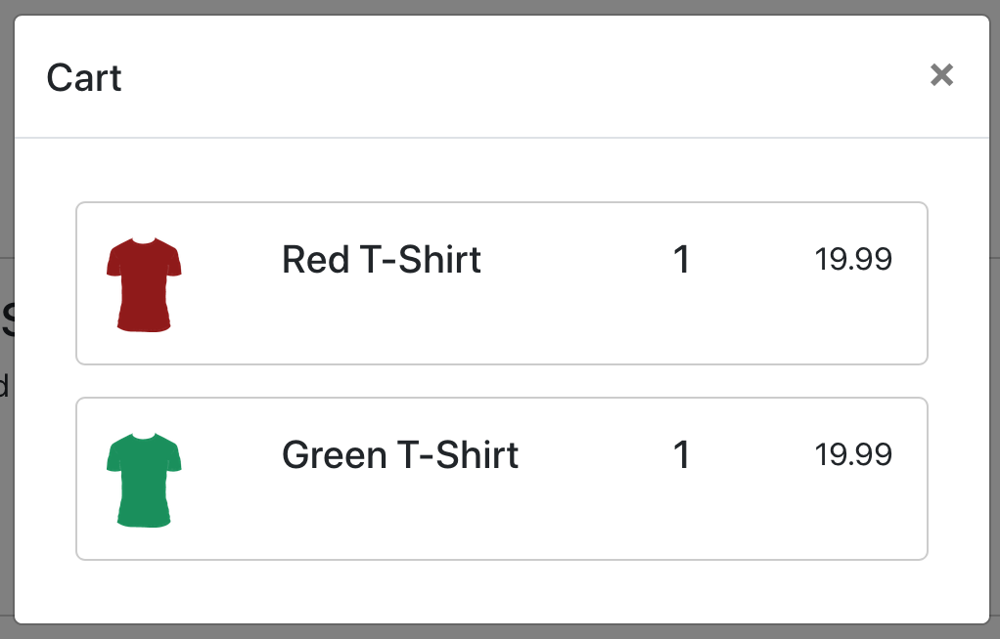
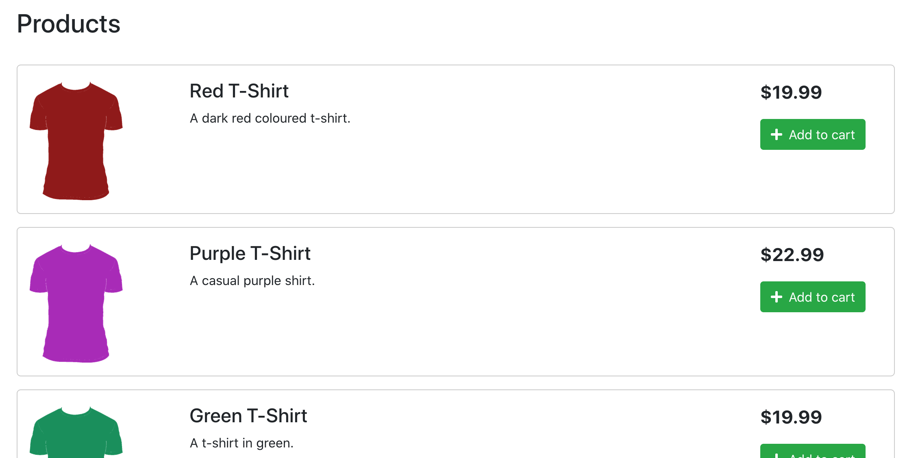
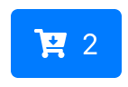
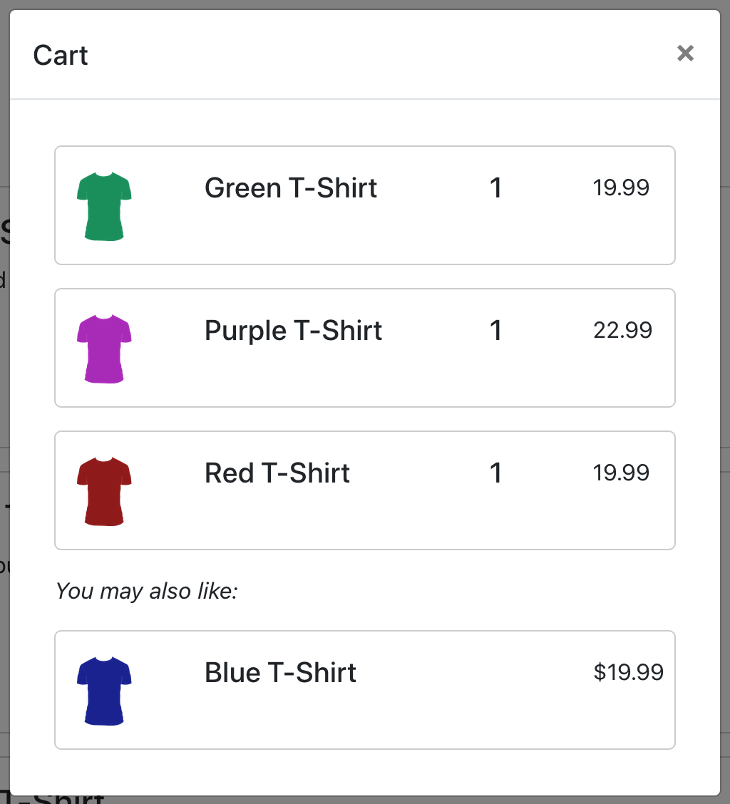
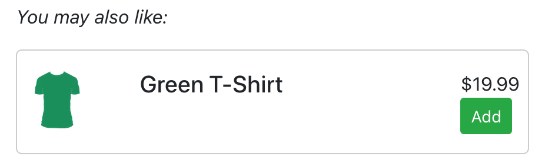

# Adding products to the cart with React.js and Commerce.js

## Overview

In the previous guide, [Listing products with React.js and Commerce.js](https://github.com/robingram/commercejs-list-products-react) we created a simple list of the products we'd created in the Chec Dashboard. Next we're going to look at how to display the contents of the cart and add those products to it. Finally, we'll add simulated recommended products to the cart to encourage further purchases.

In this guide we'll:

* Retrieve a cart from Commerce.js and make it available to our app
* Add React components to display the contents of the cart
* Extend the existing products list to allow products to be added to the cart
* Display simulated recommended products products in the cart

You can see a [live demo](http://commercejs-add-to-cart.s3-website-ap-southeast-2.amazonaws.com/) of what we'll produce.

## Requirements

As with the [previous guide](https://github.com/robingram/commercejs-list-products-react), you'll need a [Chec dashboard](https://authorize.chec.io/login) account, Node.js and npm/yarn and a code editor.

Some basic knowledge of HTML, JavaScript and Bootstrap would be helpful and you'll need to be comfortable using the command line on your computer.

## Setup

We'll build on the code from the previous guide but since this time we'll be making more use of Bootstrap elements we'll add [reactstrap](https://reactstrap.github.io/) to our app. Also we want nice icons for our cart so we'll add [FontAwesome](https://github.com/FortAwesome/react-fontawesome) too.

```
yarn add reactstrap
yarn add @fortawesome/fontawesome-svg-core @fortawesome/free-solid-svg-icons @fortawesome/react-fontawesome
```

Finally add a little CSS to the end of our `index.css` file that will be used to space out text and icons within buttons.

*src/index.css*
```
.icon-button-text-right {
  padding-left: 0.5rem;
}
```

## Using the Commerce.js cart object

The Commerce.js API provides a number of endpoints for interacting with [carts](https://commercejs.com/docs/api/#carts) and these are encapsulated in the SDK's `cart` object.

We'll need to interact with the cart in a number of places within our app:

* In the `Cart` component to display the products that are in the cart
* In the products list to be able to add products to the cart

And there are likely to be more places in future as our application grows. Therefore we will manage the state of the cart in our top level `App` component and make it available to any child components that need it.

In the standard React unidirectional data model state is passed *down* to child components through `props`. In addition, the parent component may also pass down event handler functions to update that state. This works well for small components with few children but tends to break down in situations like this where we want to access the cart in multiple children across our component hierarchy. Using the standard method we would have to pass the cart state and event handlers through multiple intermediate components that don't need to be concerned with the cart state at all.

To get around this we'll be using React [Contexts](https://reactjs.org/docs/context.html). A Context allows state that is managed in a high level component to be published via a context *provider*. Then, any child components that need to use that state can declare a *consumer* of the context in order to access the state.

We'll look at how we set this up for the cart in out `App` component and then build out the other components that will consume the context.

### Set up shared components

We will need to access the context that we create in various places across our app. In addition we will also now need to use the Commerce.js SDK in more than one component so we'll put the initialisaton of these objects into separate files that we can include where necessary. First extract the Commerce.js initialisation by creating the file `src/lib/Commerce.js` with the following contents:

```
import Commerce from '@chec/commerce.js';

export const commerce = new Commerce(process.env.REACT_APP_CJS_PUBLICKEY_TEST);
```

Notice that we're now using an *environment variable* (`REACT_APP_CJS_PUBLICKEY_TEST`) to store our API key rather than hard coding it. This is better for security. Check your operating system documentation for how to set environment variables.

Now set up a file to initialise our context. Create `src/context/CartContext.js` with these lines.

```
import React from 'react';

const CartContext = React.createContext({
  cart: {},
  setCart: () => {}
});
export default CartContext;
```

Here we're creating a Context for our cart with default values of an empty cart and an empty function for updating a cart. we'll replace these defaults when we initialise the context's provider.

### Use the context in the `App` component

Modify the `App` component to retrieve the cart and make it available to its children using the context provider. Update `App.js` to the code below.

*src/App.js*
```
import React, { useEffect, useState } from 'react';
import './App.css';
import Nav from './components/Nav';
import ProductList from './components/ProductList';
import CartContext from './context/CartContext';
import { commerce } from './lib/Commerce';

function App() {
  const [cart, setCart] = useState();

  useEffect(() => {
    commerce.cart.retrieve()
      .then(cart => {
        setCart(cart);
      })
  }, [])

  return (
    <div className="container">
      <CartContext.Provider value={{cart, setCart}}>
        <Nav />
        <div className="container">
          <h2>Products</h2>
        </div>
        <ProductList />
      </CartContext.Provider>
    </div>
  );
}

export default App;
```

The `Nav` component is new and we'll create that shortly. It will include a button to toggle a modal dialogue that contains the cart itself. First though, let's look at how we're handling the cart state.

We begin by importing the cart context and Commerce.js SDK from the files we created earlier. Next we use React's `useState` function to create the `cart` state and a function for setting that state.

```
const [cart, setCart] = useState();
```

Next we retrieve a cart object using the SDK and set it to the `cart` state. We've put this into a `useEffect` call. This can be thought of as the equivalent of `componentDidMount` which we saw in `ProductList` except for use in *functional* components, so this will be called when the component is rendered.

```
useEffect(() => {
  commerce.cart.retrieve()
    .then(cart => {
      setCart(cart);
    })
}, [])
```

Here we're calling the `cart.retrieve` function of Commerce.js. Like most of the SDK functions it returns a promise that we're handling in `then` to set the returned cart object to the component's state.

Finally we're creating a context provider to make the cart state and its associated update method available to the rest of the app.

```
<CartContext.Provider value={{cart, setCart}}>
    <Nav />
    <div className="container">
      <h2>Products</h2>
    </div>
    <ProductList />
</CartContext.Provider>
```

Whenever we create a provider we need to give it a `value`, which is the object that will be accessible by the consumers of this context. Here we're providing the object `{cart, setCart}` which contains the cart state and setter function. This is a shorthand way of writing:

```
{
  cart: cart,
  setCart: setCart
}
```

Notice that the provider component is wrapping both the `Nav` and `ProductList` components. This is necessary for them to be able to access the data from the context.

Next we'll use the context to display the contents of the cart.

## Display the cart

As mentioned above, the cart will be displayed in a modal dialog that is contained inside the `Nav` component. The component hierarchy will also include a wrapper for the entire cart, a list of cart products, a component for each line item in the cart and rows for the cart total and checkout button.

The cart with products in will look something like the image below.



Let's build that hierarchy starting with the nav bar.

*src/components/Nav.js*
```
import React, { useState, useContext } from 'react';
import {
  Navbar,
  NavbarBrand,
  Button,
  Modal,
  ModalHeader,
  ModalBody
} from 'reactstrap';
import { FontAwesomeIcon } from '@fortawesome/react-fontawesome'
import { faCartArrowDown } from '@fortawesome/free-solid-svg-icons'
import Cart from './cart/Cart';
import CartContext from '../context/CartContext';

const Nav = () => {
  const { cart } = useContext(CartContext);
  const [modal, setModal] = useState(false);
  const toggleModal = () => setModal(!modal);

  let cartItems = cart && cart.total_unique_items > 0 ? cart.total_unique_items : '';
  return (
    <Navbar>
      <NavbarBrand href="/">
        <h1>MyStore</h1>
      </NavbarBrand>
      <Button onClick={toggleModal} color="primary">
        <FontAwesomeIcon icon={faCartArrowDown} />
        <span className="icon-button-text-right">{cartItems}</span>
      </Button>
      <Modal isOpen={modal} toggle={toggleModal}>
      <ModalHeader toggle={toggleModal}>Cart</ModalHeader>
        <ModalBody>
          <Cart />
        </ModalBody>
      </Modal>
    </Navbar>
  )
}

export default Nav;
```

Much of this component consists of `reactstrap` components for creating the modal dialog and toggling its visibility. We are however accessing the `cart` state so that the cart button can include the number of items that are in the cart. We consume the `cart` state from the context with the `useContext` function. We're just using `cart` here, we won't need `setCart` because we aren't modifying the state.

```
const { cart } = useContext(CartContext);
```

We then use the `total_unique_items` attribute of the cart to display the number of items in the cart as text on the button.

Next we'll create the cart component itself in the file `src/components/cart/Cart.js`.

```
import React, { useContext } from 'react';
import CartProductList from './CartProductList';
import CartCheckoutRow from './CartCheckoutRow';
import CartTotalRow from './CartTotalRow';
import CartContext from '../../context/CartContext';

const Cart = () => {
  const { cart } = useContext(CartContext);

  if (cart &&  cart.total_unique_items > 0) {
    return (
      <div className="container cart">
        <CartProductList cart={cart} />
        <CartTotalRow cart={cart} />
        <CartCheckoutRow />
      </div>
    );
  }

  return (
    <div className="container cart">
      <p>Your cart is currently empty.</p>
    </div>
  )
}

export default Cart;

```

This again consumes the cart context and passes the `cart` object to the product list and total row as a prop. If there are no line items yet it will render a message that the cart is empty.

The cart product list will loop over the line items from the cart and render a row for each.

*src/components/cart/CartProductList.js*
```
import React from 'react';
import CartProductRow from './CartProductRow';

const CartProductList = ({ cart }) => {
  return (
    cart.line_items.map(line_item => {
      return <CartProductRow key={line_item.id} lineItem={line_item} />
    })
  );
}

export default CartProductList;
```

We access the items in the cart using its `line_items` property and `map` this to a list of `CartProductRow` components. Here is that component.

*src/components/cart/CartProductRow.js*
```
import React from 'react';

const CartProductRow = ({ lineItem }) => {
  return (
    <div className="row product">
      <div className="col-md-2">
        
      </div>
      <div className="col-md-6 product-detail">
        <h5>{lineItem.name}</h5>
      </div>
      <div className="col-md-2 cart-product-count">
        <h5>{lineItem.quantity}</h5>
      </div>
      <div className="col-md-2 cart-product-price">
        {lineItem.line_total.formatted_with_symbol}
      </div>
    </div>
  );
}

export default CartProductRow;
```

The `line_item` has many properties that are similar to a standard product with the addition of a `quantity` and `line_total`, which is the price of the product multiplied by the quantity.

We also have components to display the current cart total and a checkout button.

*src/components/cart/CartTotalRow.js*
```
import React from 'react';

const CartTotalRow = ({ cart }) => {
  return (
    <div className="row">
      <div className="col-md-12 text-right">
        Total: {cart.subtotal.formatted_with_symbol}
      </div>
    </div>
  );
}

export default CartTotalRow;
```

*src/components/cart/CartCheckoutRow.js*
```
import React from 'react';

const CartCheckoutRow = () => {
  return (
    <div className="row">
      <div className="col-md-12 text-right">
        <button className="btn btn-success">
          Checkout
        </button>
      </div>
    </div>
  );
}

export default CartCheckoutRow;
```

This cart isn't very interesting yet so let's look at how to add products to it.

## Adding products to the cart

To allow us to add products to the cart we'll update our original `ProductList` and `ProductRow` components. Our final products list will look like something like this.



*src/components/ProductList.js*
```
import React, { Component } from 'react';
import ProductRow from './ProductRow';
import CartContext from '../context/CartContext';
import { commerce } from '../lib/Commerce';

class ProductList extends Component {
  constructor(props) {
    super(props);

    this.state = {
      products: [],
    }

    this.handleAddProduct = this.handleAddProduct.bind(this);
  }

  handleAddProduct(productId) {
    commerce.cart.add(productId, 1)
      .then(result => {
        this.context.setCart(result.cart);
        alert("Product added to cart");
      });
  }

  componentDidMount() {
    commerce.products.list().then((result) => {
      this.setState({ products: result.data });
    });
  }

  render() {
    return (
      <div className="container main-content">
        {
          this.state.products.map(product => {
            return <ProductRow key={product.id} product={product} addProduct={this.handleAddProduct} />
          })
        }
      </div>
    );
  }
}

ProductList.contextType = CartContext;

export default ProductList;
```

There are some notable changes here unrelated to the context. We've replaced the original code that initialised the Commerce.js SDK with an import from our new initialiser. We're also passing the `product` object itself to the `ProductRow` as a single prop rather than splitting it out into individual props for name, image etc. This is because we will now need to access the ID of the product in the row and the number of props was becoming unwieldy.

The way that contexts are consumed in class components is slightly different from functional components. After defining the class we must set its `contextType`.

```
ProductList.contextType = CartContext;
```

This makes the cart context available within the component as `this.context`.

We've also defined a function to handle the addition of an individual product to the cart. This will be passed the ID of the product to add.

```
handleAddProduct(productId) {
  commerce.cart.add(productId, 1)
    .then(result => {
      this.context.setCart(result.cart);
      alert("Product added to cart");
    });
}
```

We also need to bind this function to `this` in our object's constructor so that we can access `this.context`.

```
this.handleAddProduct = this.handleAddProduct.bind(this);
```

The handler function calls `commerce.cart.add` with the product ID and a quantity. Since this is a simple 'add to cart' button the quantity will always be 1. The function returns a promise whose result contains an updated `cart` object, which we pass to the `setCart` function in the `CartContext`. This will update the `cart` state way up the hierarchy in the `App` component. React will notice this change and re-render all components that use the cart.

How does our `handleAddProduct` function get called? We'll pass it as a prop to each row in our products loop and use it in the `onClick` method of the "Add to cart" button.

```
this.state.products.map(product => {
  return <ProductRow key={product.id} product={product} addProduct={this.handleAddProduct} />
})
```

*src/components/ProductRow.js*
```
import React from 'react';
import { Button } from 'reactstrap';
import { FontAwesomeIcon } from '@fortawesome/react-fontawesome'
import { faPlus } from '@fortawesome/free-solid-svg-icons'

const ProductRow = ({ product, addProduct }) => {
  const handleAddProduct = e => {
    e.preventDefault();
    addProduct(product.id);
  }

  return (
    <div className="row product">
      <div className="col-md-2">
        
      </div>
      <div className="col-md-8 product-detail">
        <h4>{product.name}</h4>
        <div dangerouslySetInnerHTML={{__html: product.description}}></div>
      </div>
      <div className="col-md-2 product-price">
        <p>{product.price.formatted_with_symbol}</p>
        <Button color="success" onClick={handleAddProduct}>
          <FontAwesomeIcon icon={faPlus} />
          <span className="icon-button-text-right">Add to cart</span>
        </Button>
      </div>
    </div>
  );
}

export default ProductRow;
```

In the `ProductRow` component we've created an event handler that will call the `addProduct` function that was passed as a prop. It will pass the ID of the product that this row represents.

```
const handleAddProduct = e => {
  e.preventDefault();
  addProduct(product.id);
}
```

We've also added an "Add to cart" button with this event handler as its `onClick` prop. It is also using the FontAwesome *plus* icon.

```
<Button color="success" onClick={handleAddProduct}>
  <FontAwesomeIcon icon={faPlus} />
  <span className="icon-button-text-right">Add to cart</span>
</Button>
```

Now, when you click the Add to cart button you the number in the cart button should increase.



And when you click it the cart modal should contain the items you've added.

## Limitations

In this guide we've only covered adding products to cart. There is much more we'd need to do to make the cart functional, such as editing item quantities, removing items entirely and clearing the cart. Also, when we try to add the same product multiple times the quantity remains at 1, ideally we'd like this action to update the quantity too. The techniques used in this guide can be applied to all of these actions to make the cart more functional.

## Adding "Recommended Products"

A common feature of shopping carts is a "recommended products" section which is designed to show shoppers other items that they may like in order to encourage further purchases. We're going to create a very simple version of this that will simply display a product that isn't already in the cart. In reality you would want this to be more sophisticated, for example by using [machine learning](https://cloud.google.com/solutions/machine-learning/recommendation-system-tensorflow-overview).

Create a `RecommendedProduct` component in `src/components/cart/RecommendedProduct.js` with this content.

```
import React, { useState, useEffect } from 'react';
import { commerce } from '../../lib/Commerce';

const RecommendedProduct = ({ cart }) => {
  const [recommendedProduct, setRecommendedProduct] = useState(false);

  const cartProductIds = cart.line_items.map(line_item => line_item.product_id);

  useEffect(() => {
    commerce.products.list().then((result) => {
      result.data.some((product) => {
        if (!cartProductIds.includes(product.id)) {
          setRecommendedProduct(product);
          return true;
        }
      });
    });
  }, [])

  if (recommendedProduct) {
    return (
      <>
        <div class="row">
          <div class="col-md-12">
            <i>You may also like:</i>
          </div>
        </div>
        <div className="row product">
          <div className="col-md-2">
            
          </div>
          <div className="col-md-8 product-detail">
            <h5>{recommendedProduct.name}</h5>
          </div>
          <div className="col-md-2 cart-product-price">
            {recommendedProduct.price.formatted_with_symbol}
          </div>
        </div>
      </>
    );
  }

  return (
    <>
    </>
  );
}

export default RecommendedProduct;
```

Let's go through what this is doing.

First it is setting a recommended product to state so that the component will re-render when it changes. The default value is `false`.

```
const [recommendedProduct, setRecommendedProduct] = useState(false);
```

Next it is creating a list of the IDs of products that are already in the cart.

```
const cartProductIds = cart.line_items.map(line_item => line_item.product_id);
```

Then it is retrieving the list of products and searching it for a product that isn't in the cart so that we don't recommend something that the shopper has already added. This is happening in a `useEffect` call so that it refreshes whenever the component is rendered, e.g. when the cart changes. Note the use of the `some` method on the array of products in `result.data`. `some` is useful in this case because it ends the loop the first time the function it is passed returns `true`, so we stop looping as soon as we find a product that isn't in the cart.

```
useEffect(() => {
  commerce.products.list().then((result) => {
    setRecommendedProduct(false);
    result.data.some((product) => {
      if (!cartProductIds.includes(product.id)) {
        setRecommendedProduct(product);
        return true;
      }
    });
  });
}, [])
```

Finally, if a recommended product exists it will display the product details.

The recommendation should look something like the image below.



### Add the recommended product to the cart

Seeing a recommended product is great but it would be even better to be able to add it to the cart directly. We'll implement an Add To Cart button for this component that will look something like this:



Our add to cart functionality currently resides on the `ProductList` component and isn't accessible from the cart because it is in a different part of the component hierarchy. To address this we'll promote the functionality to the `App` component and add it to our `CartContext`.

First add an empty function to the default cart context.

*src/context/CartContext.js*
```
const CartContext = React.createContext({
  cart: {},
  setCart: () => {},
  addProductToCart: () => {},
});
```

Then implement the function in the `App` component, just after the existing `useState` call. The body of this function will be the same as the existing function in the product list.

*src/App.js*
```
const [cart, setCart] = useState();

const addProductToCart = (productId) => {
  commerce.cart.add(productId, 1)
    .then(result => {
      setCart(result.cart);
      alert("Product added to cart");
    });
}
```

Pass this down to other components in the context provider.

*src/App.js*
```
<CartContext.Provider value={{cart, setCart, addProductToCart}}>
  <Nav />
  <div className="container">
    <h2>Products</h2>
  </div>
  <ProductList />
</CartContext.Provider>
```

In our existing `ProductList` we can now remove the old fuction and call this new one from the context.

*src/components/ProductList.js*
```
handleAddProduct(productId) {
  this.context.addProductToCart(productId);
}
```

Adding products to the cart from the main product list should now be working as before so we can move on to implementing it for the recommended product.

In the `Cart` component, reference the new function from the context and pass it down to the `RecommendedProduct` as a prop, alongside the cart object.

*src/components/cart/Cart.js*
```
const { cart, addProductToCart } = useContext(CartContext);

if (cart &&  cart.total_unique_items > 0) {
  return (
    <div className="container cart">
      <CartProductList cart={cart} />
      <CartTotalRow cart={cart} />
      <RecommendedProduct cart={cart} addProductToCart={addProductToCart} />
      <CartCheckoutRow />
    </div>
  );
}
```

Now import the button component from reactstrap in `RecommendedProduct`.

*src/components/cart/RecommendedProduct.js*
```
import { Button } from 'reactstrap';
```

And add a button and handler function when there is a recommended product available.

*src/components/cart/RecommendedProduct.js*
```
if (recommendedProduct) {
  const handleAddProduct = e => {
    e.preventDefault();
    addProductToCart(recommendedProduct.id);
    setRecommendedProduct(null)
  }

  return (
    <>
      <div class="row">
        <div class="col-md-12">
          <i>You may also like:</i>
        </div>
      </div>
      <div className="row product">
        <div className="col-md-2">
          
        </div>
        <div className="col-md-8 product-detail">
          <h5>{recommendedProduct.name}</h5>
        </div>
        <div className="col-md-2 cart-product-price">
          {recommendedProduct.price.formatted_with_symbol}
          <Button color="success" onClick={handleAddProduct} size="sm">
            Add
          </Button>
        </div>
      </div>
    </>
  );
}
```

Just like in the product list this calls the `addProductToCart` function but in this case it also hides the existing recommended product because we don't want it to still be displayed when it is in the cart.

That's all we're going to cover for this guide but we hope it helps you on your way to building a functional cart with Commerce.js.
